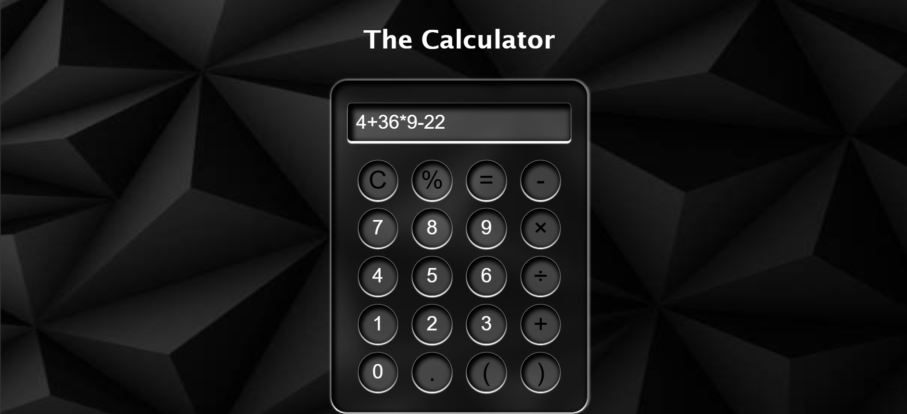

# 📱 Modern Calculator

A modern, fully functional calculator built using **HTML, CSS, and JavaScript** with a sleek dark UI design.

## 📸 Screenshot

## ⚒️ Features
- Perform all basic arithmetic operations (+, −, ×, ÷, %)
- Soft, interactive button design
- Clear functionality to reset calculations
- Supports keyboard input (if added)
- Responsive and modern UI

## ⚙️ Live Project
👉 [Try it Live here](https://codebygunjan.github.io/Calci-App/)

## 🪧 Demo

Clone the repository:

git clone
 https://github.com/codebygunjan/Calci-App.git

Open 
index.html in your browser.
No server or backend required — pure HTML, CSS & JS.

## ⚙️ Technologies Used
- HTML

- CSS

- JavaScript

- Custom UI Design

## 🍂 Author
Gunjan Harkesh Khudaniya

🔗 [LinkedIn](www.linkedin.com/in/gunjan-khudaniya-121159356)